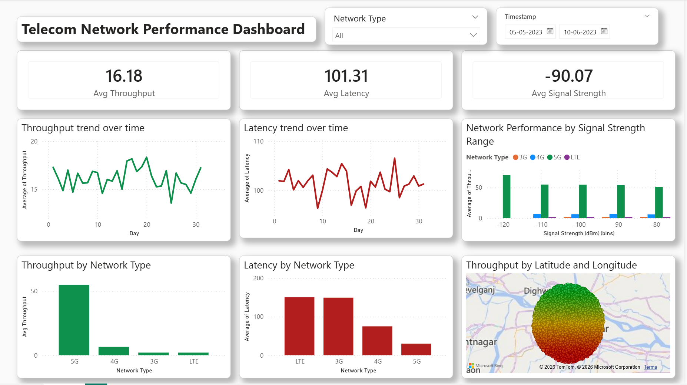

# 📡 Telecom Network Performance Dashboard

## 🚀 Project Overview
This project focuses on analyzing telecom network performance using real-world-like datasets. The objective is to evaluate network quality, identify performance bottlenecks, and generate actionable insights using data visualization.

The dashboard simulates real-world telecom analysis workflows similar to tools like Nemo Analyze, focusing on key performance indicators (KPIs) such as throughput, latency, and signal strength.

---

## 🎯 Business Problem
Telecom operators need to continuously monitor network performance to ensure optimal user experience.

This project answers:
- Where is network performance degrading?
- How does signal strength impact throughput?
- Which network types provide better performance?

---

## 🛠️ Tools & Technologies
- **Power BI** – Dashboard & Visualization  
- **Excel** – Data Cleaning & Preprocessing  
- **SQL** – Data querying (conceptual use)  
- **Python (Pandas)** – Optional data handling  

---

## 📊 Key KPIs Analyzed
- 📶 Signal Strength (dBm)  
- ⚡ Throughput (Mbps)  
- ⏱️ Latency (ms)  
- 📡 Network Type (3G / 4G / 5G / LTE)  

---

## 📈 Dashboard Features
- KPI Cards for quick performance overview  
- Time-based trend analysis (Throughput & Latency)  
- Network type comparison  
- Geographic visualization using map  
- Signal strength binning for performance segmentation  

---

## 🖼️ Dashboard Preview

---

## 🔍 Key Insights
- Strong signal strength results in significantly higher throughput  
- 5G networks consistently outperform 4G and 3G in speed  
- High latency is observed during peak usage periods  
- Poor signal regions show degraded network performance  

---

## 🧠 Analytical Approach
1. Data Cleaning & Transformation  
2. KPI Calculation & Aggregation  
3. Exploratory Data Analysis (EDA)  
4. Visualization & Dashboard Design  
5. Insight Generation  

---

## 📁 Project Structure

---

## 🚀 How to Use
1. Download the `.pbix` file  
2. Open using Power BI Desktop  
3. Interact with filters and visuals  

---

## 💡 Key Highlight
This project demonstrates how raw telecom data can be transformed into meaningful insights using data analytics and visualization techniques.

---

## 👩‍💻 About Me
I am transitioning into a Data Analyst role with hands-on experience in:
- Data cleaning & preprocessing  
- KPI analysis  
- Dashboard creation  
- Insight generation  

---

## 🔗 Connect with Me
- LinkedIn: (Add your link here)
- GitHub: (Your profile link)

---

⭐ If you found this project useful, feel free to star the repository!
